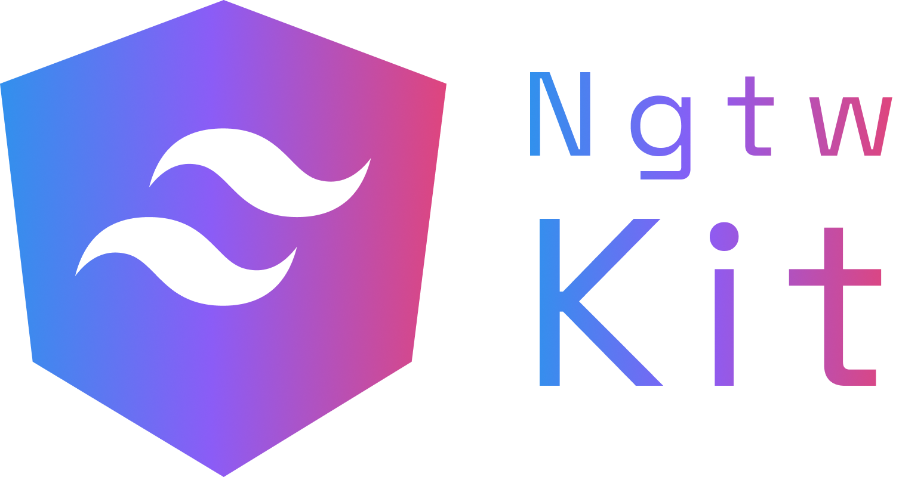

 

##  About

An UI Kit library built on top of **[Angular](https://angular.dev/)** and **[TailwindCSS](https://tailwindcss.com/)**, designed to help you deliver accessible, user-experience–focused web applications with speed and consistency.

This library provides:

- A collection of reusable directives to simplify common UI patterns.

- Utility functions to reduce boilerplate and promote clean code.

- Injection tokens for flexible and decoupled configuration.

- Predefined constants and structured data models to support standardized integration.

- Strong accessibility (a11y) support, aligned with WAI-ARIA best practices.

- First-class support for Angular Signals (if targeting Angular 16+).

Fully compatible with modern Angular (v16+), and optimized for scalability, customization, and seamless integration into existing Angular applications.

##  Packages

This library is modular and split into three focused sub-packages to encourage separation of concerns, better tree-shaking, and clearer usage.

Each package can be installed and imported independently, depending on your project’s needs.

[`@ngtw-kit/common`](libs/common/README.md)

[`@ngtw-kit/components`](libs/components/README.md)

[`@ngtw-kit/directives`](libs/directives/README.md)

##  Compatibility

The following table shows the compatibility between Ngtw-Kit and Angular versions:

##  Contributing

| Ngtw-Kit | Angular | TailwindCSS |
| -------- | ------- | ----------- |
| 0.0.1+   | 20.x.x  | 4.x.x       |

Contributions are welcome and encouraged. This library is built to be extensible, maintainable, and aligned with Angular's best practices.

### How to Contribute

[Check out our guidelines](CONTRIBUTING.md)

##  Changelog

[Check out the latest updates to the library](CHANGELOG.md)
